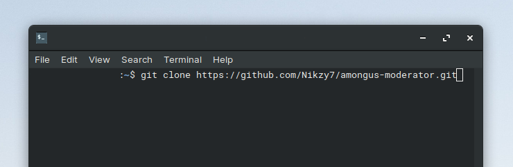

[]()
# Among Us Moderator
> A discord bot made to moderate ingame participants over the voice channel

> #Node #DiscordWebhooks #AmongUs #GUIconsole

<br>

[](https://badge.fury.io/js/discord.js) [](https://github.com/Nikzy7/amongus-moderator/issues) [](https://github.com/Nikzy7/amongus-moderator/pulls)

<br>
<div align="center">
  
</div><br><br>


## Getting Started
-----
Built to mute all the participants present in a specific voice channel in a discord server. Created using Node.js, the GUI console used to mute the participants leverages the discord webhooks and discord.js v12.

- Clone or download the repository to get started
- Should have node installed on your local system
- A discord server with available voice channels

### Clone

- Clone this repo to your local machine using `https://github.com/Nikzy7/amongus-moderator.git`



## Usage
- After cloning the repository

<div align="center">
  
</div>
<br>

1. Navigate to __index.js__ to add your bot token.
2. Add your discord voice channel's ID
3. Create a text channel in the same server and add a webhook.
4. Paste your webhook's URL into __console.py__
5. Add your webhook's name in the __index.js__ 'message.author.username'
5. Host it on Heroku

### Commands
```
/muteall # To mute all users
```
```
/unmuteall # To unmute all users
```
<br>
---
## Contributing [](https://github.com/dwyl/esta/issues)
- Contributions are heartly welcomed, play and tweak with the project and submit your pull requests.

## Need Help?
1.  Check out my profile for my contact info
2.  Mail your queries at nikzy7@protonmail.com

I'll be happy to help 😄️

---
Hosted with a lot of ❤️ on Heroku.
