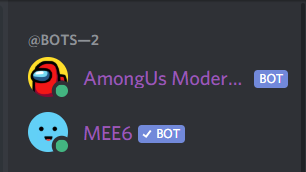

# Among Us Moderator

Among Us Moderator is a Discord bot built to help Among Us voice channels. This bot was created using NodeJS, Discord webhooks, and Discord.js.

  

## Usage
First, type:

`git clone https://github.com/Nikzy7/amongus-moderator.git` 
`cd amongus-moderator`

Then, navigate to index.js and add your own bot [token](https://www.writebots.com/discord-bot-token/). Add your [server's Among Us voice channel ID](https://support.discord.com/hc/en-us/articles/206346498-Where-can-I-find-my-User-Server-Message-ID-) by right clicking on the channel with developer tools on into index.js. Create a text channel and add a [webhook](https://support.discord.com/hc/en-us/articles/228383668-Intro-to-Webhooks). Then, copy the webhook's URL and paste it into console.py. 

Then run the bot:

`node index.js`

  

## Commands

#### `/muteall`
 - Mutes everyone in a channel

#### `/unmuteall`
  - Unmutes everyone in a channel

## Contact

Contact me at nikzy7@protonmail.com  
For other ways to contact me , check out my profile [here.](https://github.com/Nikzy7)

----------------------
Hosted with a lot of :heart: on Heroku.
